# UML Class Diagram - ARP Spoofing Tool

## Overview

This diagram shows the class structure and relationships in the ARP spoofing tool, including Windows, Linux, and macOS platform implementations.

## Class Diagram

```mermaid
classDiagram
    class App {
        -static App* instance
        -std::unique_ptr~ArpSpoofer~ spoofer
        -std::unique_ptr~NetworkInterface~ networkInterface
        -std::unique_ptr~RawSocket~ rawSocket
        -bool isRunning
        +static App* getInstance()
        +void initialize()
        +void run(int argc, char* argv[])
        +void stop()
        -void listInterfaces()
        -void startSpoofing(const std::string& interfaceName, const std::string& targetIp, const std::string& spoofedIp)
        -void printUsage()
    }

    class ArpSpoofer {
        -std::unique_ptr~NetworkInterface~ networkInterface
        -std::unique_ptr~RawSocket~ rawSocket
        -std::string interfaceName
        -std::vector~uint8_t~ targetMac
        -std::vector~uint8_t~ spoofedMac
        -std::vector~uint8_t~ targetIp
        -std::vector~uint8_t~ spoofedIp
        -std::vector~uint8_t~ myMac
        -std::vector~uint8_t~ myIp
        -bool isRunning
        -std::thread spoofThread
        +ArpSpoofer(std::unique_ptr~NetworkInterface~ netIf, std::unique_ptr~RawSocket~ socket)
        +bool start(const std::string& interfaceName, const std::string& targetIp, const std::string& spoofedIp)
        +void stop()
        -void spoofLoop()
        -std::vector~uint8_t~ createArpPacket(const std::vector~uint8_t~& senderMac, const std::vector~uint8_t~& senderIp, const std::vector~uint8_t~& targetMac, const std::vector~uint8_t~& targetIp, uint16_t operation)
        -void forwardPacket(const std::vector~uint8_t~& packet)
        -bool isArpPacket(const std::vector~uint8_t~& packet)
        -bool isTargetPacket(const std::vector~uint8_t~& packet)
    }

    class PlatformFactory {
        +static std::unique_ptr~NetworkInterface~ createNetworkInterface()
        +static std::unique_ptr~RawSocket~ createRawSocket()
    }

    class NetworkInterface {
        <<interface>>
        +virtual ~NetworkInterface() = default
        +virtual std::vector~InterfaceInfo~ getInterfaces() = 0
        +virtual std::vector~uint8_t~ resolveMacAddress(const std::string& interfaceName, const std::vector~uint8_t~& ip) = 0
    }

    class RawSocket {
        <<interface>>
        +virtual ~RawSocket() = default
        +virtual bool open(const std::string& interfaceName, bool promiscuous = true) = 0
        +virtual void close() = 0
        +virtual bool sendPacket(const std::vector~uint8_t~& data) = 0
        +virtual std::vector~uint8_t~ receivePacket() = 0
        +virtual bool isOpen() const = 0
    }

    class WindowsNetworkInterface {
        +WindowsNetworkInterface()
        +~WindowsNetworkInterface()
        +std::vector~InterfaceInfo~ getInterfaces() override
        +std::vector~uint8_t~ resolveMacAddress(const std::string& interfaceName, const std::vector~uint8_t~& ip) override
        -std::vector~InterfaceInfo~ getInterfacesFromAdapter()
        -std::vector~uint8_t~ getMacFromArpTable(const std::string& interfaceName, const std::vector~uint8_t~& ip)
        -std::vector~uint8_t~ sendArpRequest(const std::string& interfaceName, const std::vector~uint8_t~& ip)
    }

    class LinuxNetworkInterface {
        +LinuxNetworkInterface()
        +~LinuxNetworkInterface()
        +std::vector~InterfaceInfo~ getInterfaces() override
        +std::vector~uint8_t~ resolveMacAddress(const std::string& interfaceName, const std::vector~uint8_t~& ip) override
        -int getInterfaceFlags(const std::string& interfaceName)
        -std::vector~uint8_t~ getInterfaceMacAddress(const std::string& interfaceName)
        -std::vector~uint8_t~ getInterfaceIpAddress(const std::string& interfaceName)
        -uint8_t getInterfaceNetmask(const std::string& interfaceName)
        -std::vector~uint8_t~ getDefaultGateway(const std::string& interfaceName)
    }

    class MacOSNetworkInterface {
        +MacOSNetworkInterface()
        +~MacOSNetworkInterface()
        +std::vector~InterfaceInfo~ getInterfaces() override
        +std::vector~uint8_t~ resolveMacAddress(const std::string& interfaceName, const std::vector~uint8_t~& ip) override
        -int getInterfaceFlags(const std::string& interfaceName)
        -std::vector~uint8_t~ getInterfaceMacAddress(const std::string& interfaceName)
        -std::vector~uint8_t~ getInterfaceIpAddress(const std::string& interfaceName)
        -uint8_t getInterfaceNetmask(const std::string& interfaceName)
        -std::vector~uint8_t~ getDefaultGateway(const std::string& interfaceName)
    }

    class WindowsRawSocket {
        -SOCKET socketHandle
        -bool isOpen
        -std::string interfaceName
        +WindowsRawSocket()
        +~WindowsRawSocket()
        +bool open(const std::string& interfaceName, bool promiscuous = true) override
        +void close() override
        +bool sendPacket(const std::vector~uint8_t~& data) override
        +std::vector~uint8_t~ receivePacket() override
        +bool isOpen() const override
    }

    class LinuxRawSocket {
        -int socketFd
        -bool isOpen
        -std::string interfaceName
        +LinuxRawSocket()
        +~LinuxRawSocket()
        +bool open(const std::string& interfaceName, bool promiscuous = true) override
        +void close() override
        +bool sendPacket(const std::vector~uint8_t~& data) override
        +std::vector~uint8_t~ receivePacket() override
        +bool isOpen() const override
    }

    class MacOSRawSocket {
        -int bpfFd
        -bool isOpen
        -std::string interfaceName
        +MacOSRawSocket()
        +~MacOSRawSocket()
        +bool open(const std::string& interfaceName, bool promiscuous = true) override
        +void close() override
        +bool sendPacket(const std::vector~uint8_t~& data) override
        +std::vector~uint8_t~ receivePacket() override
        +bool isOpen() const override
    }

    class IPAddress {
        -uint8_t bytes[4]
        +IPAddress()
        +IPAddress(uint8_t a, uint8_t b, uint8_t c, uint8_t d)
        +IPAddress(const std::string& address)
        +static IPAddress fromString(const std::string& address)
        +std::string toString() const
        +uint32_t toUint32() const
        +std::vector~uint8_t~ toBytes() const
        +bool isPrivate() const
        +bool isLocalhost() const
        +bool isPublic() const
        +bool operator==(const IPAddress& other) const
        +bool operator!=(const IPAddress& other) const
        +bool operator<(const IPAddress& other) const
        +IPAddress operator&(const IPAddress& mask) const
        +IPAddress operator|(const IPAddress& mask) const
        +IPAddress operator~() const
        +static const IPAddress Any
        +static const IPAddress Localhost
        +static const IPAddress Broadcast
    }

    class InterfaceInfo {
        +std::string name
        +std::string description
        +bool isUp
        +std::vector~uint8_t~ mac
        +std::vector~uint8_t~ ip
        +uint8_t prefixLength
        +std::vector~uint8_t~ gateway
    }

    %% Relationships
    App --> ArpSpoofer : creates
    App --> PlatformFactory : uses
    PlatformFactory --> NetworkInterface : creates
    PlatformFactory --> RawSocket : creates
    NetworkInterface <|-- WindowsNetworkInterface : implements
    NetworkInterface <|-- LinuxNetworkInterface : implements
    NetworkInterface <|-- MacOSNetworkInterface : implements
    RawSocket <|-- WindowsRawSocket : implements
    RawSocket <|-- LinuxRawSocket : implements
    RawSocket <|-- MacOSRawSocket : implements
    ArpSpoofer --> NetworkInterface : uses
    ArpSpoofer --> RawSocket : uses
    ArpSpoofer --> IPAddress : uses
    NetworkInterface --> InterfaceInfo : returns
```

## Key Design Patterns

### 1. Singleton Pattern (App)
- Ensures only one instance of the application exists
- Provides global access point to application functionality
- Manages application lifecycle

### 2. Factory Pattern (PlatformFactory)
- Creates platform-specific implementations
- Encapsulates platform detection logic
- Enables easy extension to new platforms

### 3. Strategy Pattern (NetworkInterface/RawSocket)
- Defines common interface for different platforms
- Allows runtime selection of platform implementation
- Promotes code reuse and maintainability

### 4. RAII (Resource Acquisition Is Initialization)
- Automatic resource management in constructors/destructors
- Exception-safe resource handling
- Prevents resource leaks

## Platform Abstraction

The application uses a platform abstraction layer to support multiple operating systems:

- **Windows**: Uses WinPcap/Npcap APIs and Windows socket functions
- **Linux**: Uses native Linux socket API and system calls
- **macOS**: Uses BPF (Berkeley Packet Filter) API and sysctl system calls
- **Future**: Easy to extend for BSD, Solaris, etc.

## Cross-Platform Features

- **Network Interface Detection**: Automatic discovery of available interfaces
- **MAC Address Resolution**: ARP table lookup and request sending
- **Raw Socket Operations**: Direct packet manipulation
- **Error Handling**: Platform-specific error codes and messages
- **Memory Management**: Smart pointers for automatic cleanup

## Platform-Specific Implementations

### Windows
- Uses WinPcap/Npcap for packet capture
- Windows socket API for network operations
- Registry and WMI for interface information

### Linux
- Native socket API with AF_PACKET
- ioctl calls for interface configuration
- /proc filesystem for system information

### macOS
- BPF (Berkeley Packet Filter) for packet capture
- sysctl API for system information
- BSD socket API for network operations 