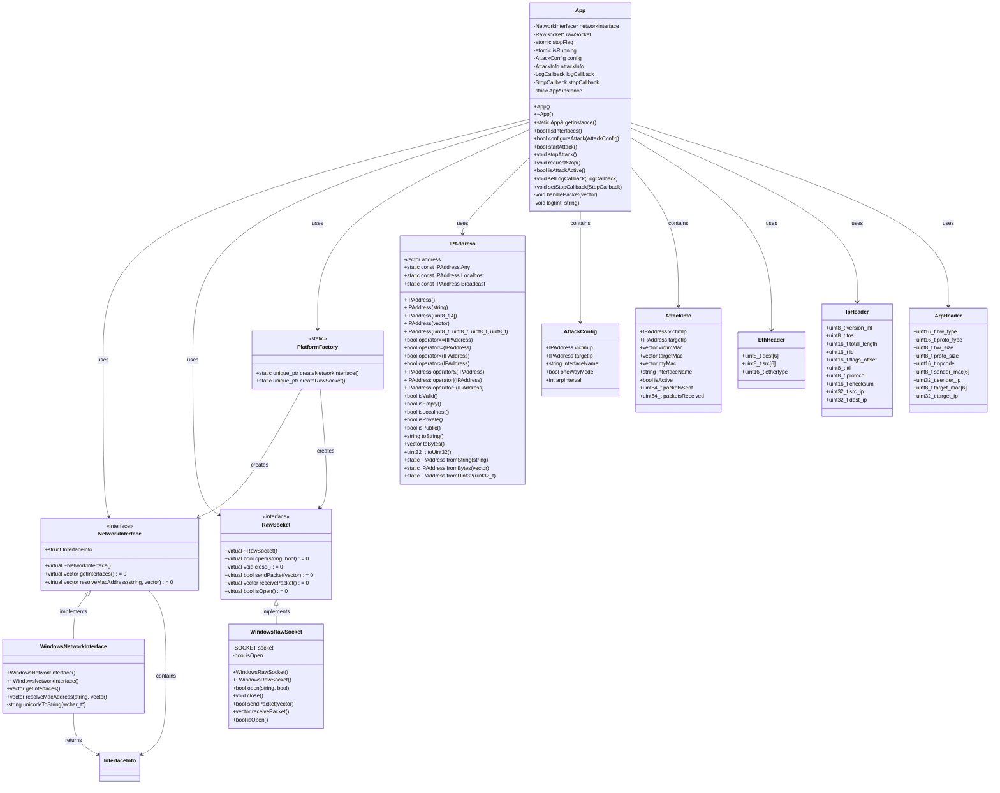
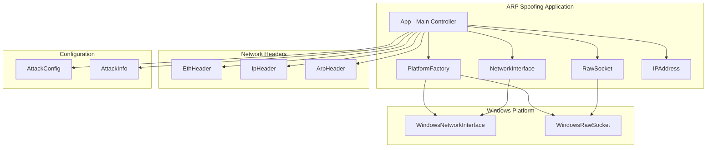
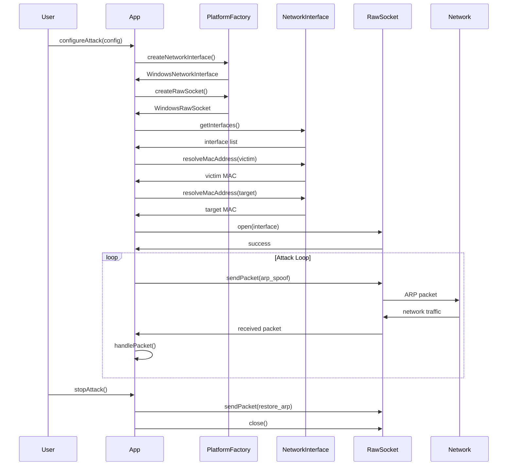

# ARP Spoofing Tool - UML Class Diagram

## Class Diagram

## Component Diagram

## Sequence Diagram - Attack Flow

## Design Patterns Used

1. **Singleton Pattern** - App class
2. **Factory Pattern** - PlatformFactory
3. **Strategy Pattern** - NetworkInterface and RawSocket abstractions
4. **RAII** - Resource management in all classes
5. **Observer Pattern** - Callback system for logging and stop events

## Key Features

- **Cross-platform abstraction** through PlatformFactory
- **Modern C++17** with smart pointers and atomics
- **Thread-safe** operations with atomic flags
- **Callback system** for extensibility
- **Comprehensive IP address** manipulation
- **Raw socket** networking capabilities 